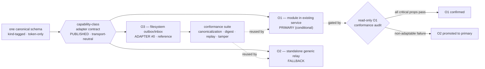
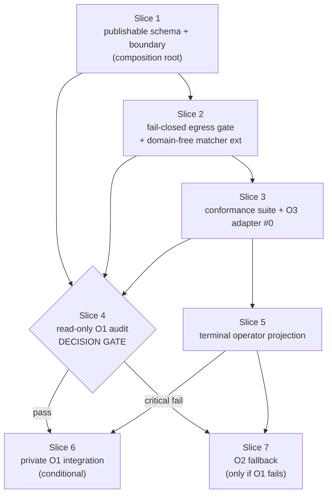
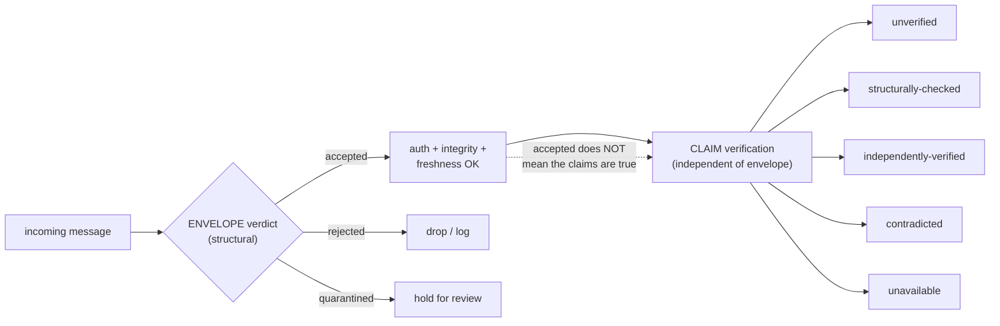

# Decision: Repo-Mail Inter-Repo Communication Protocol

**Date:** 2026-07-26
**Status:** Accepted (record-of-decision) at decision granularity. **Build HOLD:** slice execution is gated on (a) operator post-review of this memo AND (b) the O1 private conformance audit, which runs on the carrier side (not in this repo) and is operator-initiated separately. Slice 2 (scrub-gate extension) is the riskiest slice per Caveat 1 and must build against committed canon, not chat memory — it must not begin before this memo lands and both gates clear.
**Basis:** the 2026-07-26 repo-mail design brief (read-only solution-brief pass); the existing `forbidden-patterns` + `auto-gate-scrub` seams; the F2 capability-class slot precedent (`internal/cli/f2_pb.go`, `internal/cli/f2_projection.go`, `core/media-perception`); the HANDOFF convention (`docs/coordination/HANDOFF_TEMPLATE.md`, `handoff-save`).
**Supersedes:** none (first record-of-decision for inter-repo communication).
**See also:** [`./2026-07-25-f1-synthesis-family-and-s2a-topology.md`](./2026-07-25-f1-synthesis-family-and-s2a-topology.md) "Governance (operator ruling, 2026-07-26)" section — canonical home of the `15ddd54` house rule + standing-policy ruling that this memo's verbatim-schema discipline follows.

## Framing

Repo-mail mechanizes today's operator copy-paste handoffs between arbitrary repo pairs. Purpose is BINDING — information passing ONLY: no reaction rule may spawn a session, dispatch work, or execute anything; delivery terminates at operator-visible surfaces (notification, inbox view, digest, priority marking). The operator is the sole bridge from information to action. Threat model = leak / spoof / noise, NOT execution.

Two representative uses: (a) adopter→maintainer reports/replies; (b) peer↔peer design collaboration (precedent: two consumer repos once co-designed a shared component — referred to here only by `channel-id`/`channel-class`). Message kinds: `report`, `reply`, `design-question/RFC`, `handoff` — one schema, kind-tagged, with thread/correlation ids for multi-turn dialogues.

Binding constraints: (1) anonymization — no repo identity/feature text in anything committed/published/deployed; protocol is generic, all specifics (channel registry, tokens, endpoints, forbidden-patterns) in private config; (2) client-side fail-closed identity-scrub before send, reusing `forbidden-patterns` + `auto-gate-scrub` (`scrubCredentials`/`scrubTruncate`/`truncate`), relays untrusted-by-design; (3) delivery rules are off-repo config — the corpus publishes only the rule SCHEMA, and no actuation vocabulary exists in that schema by design; (4) message content is claims-to-verify under the premise-recheck discipline, with per-channel sender auth.

## Decision 1 — Transport verdict: O1 conditional primary, O2 fallback, O3 reference adapter

One transport-neutral, kind-tagged protocol shared by three adapters:

- **PRIMARY (conditional) — O1, module in the existing remotely-deployed service.** Chosen because auth/queue/push already exist there; reusing that boundary avoids spawning a new authenticated principal, credential store, ingress surface, queue, and failure domain. NOT chosen on cost.
- **FALLBACK — O2, standalone generic relay.** Used if O1 cannot satisfy a critical property without weakening the protocol.
- **ADAPTER #0 / reference — O3, filesystem outbox/inbox.** Same-machine reference + conformance fixture, not the remote default.

The primary remains CONDITIONAL until a read-only private conformance audit proves: exact-byte preservation; channel-scoped directional authorization; digest/authenticator carriage and verification; freshness/replay/idempotency; channel isolation; terminal-only projection; absence of semantic rewriting; no hidden connection to work-bearing state. If any non-adaptable critical property fails, O2 becomes primary. The publishable protocol must not depend on O1 so O2 can conform without schema changes. The corpus publishes only the transport-agnostic capability-class adapter contract — no vendor/transport identity (mirrors the F2 evidence-slot + media-perception precedent).

## Decision 2 — Load-bearing property: Non-Actuation by Construction

> **[VERBATIM — the named load-bearing safety property]**
> The delivery-rule schema is intentionally incapable of representing a work-causing target or transition. This is a type-and-vocabulary property, not merely a policy recommendation.

The publishable delivery-rule vocabulary is limited to observable surfaces ONLY: `notify`, `inbox`, `digest`, `priority`, `quiet_hours`, `sender_auth_requirement`, `delivery_status`. The schema contains NO fields for sessions, task records, ownership, work routing, executable callbacks, approval transitions, or automatic replies. Because these concepts are absent from the type, private misconfiguration cannot express them. This is the design's spine and is non-negotiable; no later slice may add an actuation verb to the schema.

## Contract A — Canonical message envelope (FIELD-LEVEL SCHEMA, VERBATIM per the 15ddd54 house rule)

> **[VERBATIM — field-level schema; downstream slices (egress gate, conformance suite) map to these fields. Reproduce exactly, do not summarize.]**

| Field | Meaning and constraints |
|---|---|
| `schema_version` | Closed protocol schema version. |
| `message_id` | Globally unique opaque identifier. |
| `kind` | Closed set: `report`, `reply`, `design-question/RFC`, `handoff`. |
| `thread_id` | Opaque identifier shared by one dialogue. |
| `correlation_id` | Opaque identifier connecting related messages or observations. |
| `in_reply_to` | Optional prior `message_id`; required for `reply`. |
| `provenance_class` | Generic source class, without participant identity. |
| `sender.channel_id` | Opaque private-registry identifier. |
| `sender.channel_class` | Transport-neutral capability class. |
| `sender.key_id` | Opaque key reference; no credential material. |
| `recipient.channel_id` | Opaque destination identifier. |
| `recipient.channel_class` | Transport-neutral destination class. |
| `contract_version_range` | Protocol/client contract versions the content targets. |
| `issued_at` | Sender timestamp. |
| `expires_at` | Optional bounded validity time. |
| `sequence` | Optional monotonic channel-direction value for gap and replay detection. |
| `claims[]` | Sanitized statements, source references, confidence, verification state, and limitations. |
| `premises[]` | Load-bearing premise tuples. |
| `evidence_refs[]` | Sanitized, non-secret references usable for later verification. |
| `contradictions[]` | Explicit contradictions or a closed "none detected in checked scope" token. |
| `limitations[]` | Known evidence and interpretation limits. |
| `presentation_request` | Requested notification/inbox/digest presentation and priority only. |
| `scrub.policy_version` | Opaque version of the private egress policy used. |
| `scrub.result` | Must be `passed`; absence or uncertainty prevents sending. |
| `integrity.content_digest` | Digest over the exact canonical bytes transmitted. |
| `integrity.authenticator` | End-to-end sender authenticator over those bytes. |

**Verdict separation (VERBATIM enums):**
- Envelope verdict: `accepted | rejected | quarantined`
- Claim verification: `unverified | structurally-checked | independently-verified | contradicted | unavailable`

An `accepted` envelope means ONLY that authentication, integrity, freshness, and structural checks passed. It does NOT establish that its claims are true.

**Kind semantics:** `report` (observations/claims/evidence/contradictions/limitations); `reply` (informational response via `in_reply_to`, conveys no implicit acceptance or state change); `design-question/RFC` (question, constraints, candidate interpretations, known evidence, unresolved gaps); `handoff` (informational continuity across a boundary — aligns with the HANDOFF convention on bounded scope, evidence/confidence/provenance, contradictions, premise tuples, verification state, constraints/non-goals/limitations; DELIBERATELY OMITS ownership, assignee, target session, prescribed next steps, command directives, requested files/outputs, transition requests, deadlines, and work-queue meaning).

## Contract B — Channel lifecycle

Establishment via a private registry: opaque `channel-id`, generic `channel-class`, allowed direction, sender/recipient key references, authentication requirements, private delivery-policy reference. No real identity mapping appears in a message, published schema, overlay template, or committed doc. Directionality: one-way = one directional sender authorization; bidirectional = two INDEPENDENT directional authorizations (NOT one shared unrestricted credential — each direction has its own key lifecycle, sequence/replay state, revocation). Rotation: introduce new key-id privately → bounded overlap → explicit acceptance window → retire old; never place key material in the envelope. Revocation is deny-first: stop accepting the sender/key pairing, retain non-secret metadata to detect later replay, surface rejections as operator-visible security observations when configured, require explicit private re-establishment.

## Contract C — Client egress gate (fail-closed)

One mandatory gate after canonical serialization and before every adapter. Reuses generic/private `forbidden-patterns` composition + `scrubCredentials`/`scrubTruncate`/`truncate`. Any identity match, credential indication, unknown field, invalid identifier class, or uncertain result REJECTS the send. The outbound message is NEVER silently redacted or truncated (transform-and-send is prohibited). Digest + authenticator bind to the original canonical bytes. Bounded diagnostics are local-only.

## Authority-line audit

Every repo-mail mechanism INFORMs; none carries transition authority. Receipt never changes task state, creates ownership, enters an execution-bearing queue, or authorizes a side effect. The delivery-rule schema's Non-Actuation by Construction (Decision 2) is what makes this a type property rather than a policy hope. If any implementation attempts to make receipt a prerequisite for build-ready, release, or coordinator state movement, that portion must be removed.

## Failure modes

| Failure | Defense + locus | Residual risk |
|---|---|---|
| Identity leakage | Client gate: closed schema, identifier allow-list, generic + private forbidden-pattern checks over every scalar and the canonical serialization; reject uncertain | Previously unknown aliases / encoded identity / contextual descriptions may evade heuristic matching |
| Credential leakage | Client gate: reuse `scrubCredentials`; if applying it would change the original, reject | Helper detection is best-effort, not a proof |
| Sender spoofing | Per-channel directional auth, key-id lookup, recipient-side authenticator verify | Compromised sender creds remain valid until rotation/revocation |
| Relay mutation | Per-channel digest + authenticator bind exact bytes; recipient rejects mismatch | Compromised relay can still suppress/delay/reorder/observe metadata |
| Replay / duplicate | Per-channel recipient state: uniqueness, expiry, optional sequence, idempotent projection | Sequence gaps reveal missing info but not why |
| Egress-gate bypass | Single mandatory post-serialize/pre-adapter gate; adapter conformance tests; no alternate send path | Private integration outside the audited boundary can violate the contract |
| Stale inbox | Operator-as-bridge: timestamps, expiry, claim status, premise tuples, re-derivation before reliance | Rechecking is a human/session discipline; the mail layer cannot prove it occurred |
| Noise / fatigue | Private delivery rules: digest grouping, quiet hours, priority, sender-auth requirements, dedup | Poor private config can still hide or over-surface |
| Relay compromise/outage | Untrusted-relay posture: end-to-end verify, terminal delivery status, honest `unavailable`/uncertain, adapter-independent retry | Confidentiality needs a separately specified protection layer; auth+integrity alone do not conceal content/traffic |
| Message mistaken for instruction | Schema omission + operator-as-bridge: claims-to-verify labels, informational `handoff`, absence of work-bearing fields | A human can still choose to rely on an unverified claim |

## Boundary table (publishable → private)

| Component | `templates/core` (publishable, token-only) | overlay (optional reuse) | `.local` (operator runtime) | deployment-config (off-repo private) |
|---|:---:|:---:|:---:|:---:|
| Envelope schema + closed enums | **normative** | · | · | · |
| Delivery-rule schema (Non-Actuation) | **normative** | · | · | · |
| Capability-class adapter contract | **normative** | impl may conform | · | private binding |
| Egress-gate contract | **normative** | integration | diagnostics | policy version |
| `forbidden-patterns` generic builders | **normative** | · | · | · |
| `scrubCredentials` helper | contract only | **current impl seam** | bounded diag | private ext |
| Channel registry / identity map | id format only | · | cache at most | **authoritative** |
| Keys / tokens / endpoints | reference only | · | short-lived cache | **material** |
| Delivery-rule instances | never | · | eval cache | **instances** |
| O1 / O2 / O3 adapter bindings | adapter contract | generic shim | O3 runtime | **deployment** |

(Anonymization rule: anything that could identify a repo/endpoint/credential slides right, into private config.)

## Mental-model diagrams (Mermaid — render natively; carry the design spine)

### D1. Egress spine — where each defense lives

```mermaid
flowchart TD
    A["Compose message<br/>report / reply / RFC / handoff"] --> B["Canonical serialize<br/>(deterministic bytes)"]
    B --> G{"EGRESS GATE<br/>fail-closed · client-side"}
    G --> G1["forbidden-patterns<br/>(generic + private ext)"]
    G --> G2["scrubCredentials<br/>any mutation = REJECT"]
    G --> G3["identifier allow-list<br/>(channel-id/class only)"]
    G1 --> R{"clean?"}
    G2 --> R
    G3 --> R
    R -->|"uncertain / dirty"| REJ["REJECT send<br/>(never transform-and-send)"]
    R -->|clean| D["Bind digest + authenticator<br/>over canonical bytes"]
    D --> E["Adapter (O1 / O2 / O3)"]
    E --> RELAY[("UNTRUSTED RELAY<br/>can suppress · delay · reorder · observe<br/>CANNOT mutate undetected)"]
    RELAY --> F["Recipient verify<br/>auth + digest + freshness + replay"]
    F -->|accepted| T["TERMINAL PROJECTION<br/>notify · inbox · digest · priority"]
    F -->|rejected / quarantined| T2["Security observation<br/>(if configured)"]
    T --> OP(("OPERATOR<br/>sole bridge<br/>info → action"))
    T2 --> OP
```

### D2. Non-Actuation by Construction — the safety crux

```mermaid
flowchart LR
    subgraph CAN["delivery-rule schema CAN express<br/>(observable surfaces only)"]
        direction TB
        C1["notify — where"]
        C2["inbox — which"]
        C3["digest — cadence"]
        C4["priority — marking"]
        C5["quiet_hours"]
        C6["sender_auth_requirement"]
        C7["delivery_status"]
    end
    subgraph CANNOT["structurally ABSENT — no vocabulary exists<br/>(by design, not by policy)"]
        direction TB
        X1["session spawn"]
        X2["task / ownership"]
        X3["work routing"]
        X4["executable callback"]
        X5["approval / transition"]
        X6["auto-reply"]
        X7["work-bearing queue entry"]
    end
    CAN ==>|"misconfig cannot cross<br/>— the verbs don't exist"| CANNOT
```



### D3. Transport choice — why O1 is conditional



### D4. Slice dependency DAG



### D5. Verdict separation — accepted ≠ true



## Slice plan (build-ready IF later authorized; NOT authorized by this memo — see Status HOLD)

- **Slice 1 — Publishable schema + boundary (composition root).** Four-kind envelope; Non-Actuation delivery-rule schema; capability-class adapter contract; publishable/private boundary; conformance-property requirements without claiming an implementation. Placement: `templates/core/.opencode/` source path + corpus manifest registration if needed; tests at the verified schema/render seam. Dependency: none.
- **Slice 2 — Fail-closed client egress gate.** Single mandatory post-canonicalization/pre-adapter gate; reuse `forbidden-patterns` + scrub helpers; reject on mutation/unknown-field/uncertain; bind digest+authenticator to canonical bytes; local-only diagnostics. **THIS IS THE RISKIEST SLICE (see Caveat 1): likely needs a domain-free matcher extension to validate arbitrary message scalars, not just command strings; must build against committed canon.** Placement: generic gate under `templates/core/.opencode/`; integration under `templates/overlays/<pack>/`. Dependency: Slice 1.
- **Slice 3 — Adapter-neutral conformance suite + O3 adapter #0.** One conformance suite for all adapters; filesystem adapter as local reference; atomic writes, immutability, duplicate/replay/expiry/tamper, deterministic terminal projection; path mappings private. Placement: conformance fixtures at the verified test seam; optional adapter under `templates/overlays/<repo-mail-pack>/`; runtime fixtures under `tmp/`. Dependency: Slices 1–2.
- **Slice 4 — Read-only private O1 conformance audit (DECISION GATE; carrier-side, operator-initiated).** Property-by-property conformance matrix (`pass` / `adaptable gap` / `critical failure`) against the published adapter contract: channel-scoped auth, exact-byte preservation, digest/authenticator support, replay/expiry/idempotency, channel isolation, terminal-only projection, no hidden work-bearing integration, content confidentiality (E2E body encryption). No repo files. Dependency: Slice 1 (+ Slices 2–3 supply gate requirements and reusable tests).
- **Slice 5 — Terminal operator projection.** Deterministic notification/inbox/digest/priority; non-authoritative local dedup/presentation caches; claims-to-verify labels; freshness/auth/contradictions/limitations/premise tuples visible; manual operator bridging preserved. Placement: optional protocol overlay; `.local/repo-mail/` for cache/diagnostics (do NOT reuse `.local/coordinator/` task transport); private rule instances in deployment config. Dependency: Slices 1–3.
- **Slice 6 — Private O1 integration (CONDITIONAL on Slice 4 pass).** Private module + channel bindings; registry/credentials/endpoints/directional-auth/replay-state/delivery-rules off-repo; same adapter conformance suite as O3. Placement: private deployment config + service module only; no participant-specific values in `templates/core` or publishable overlay. Dependency: Slice 4 all critical properties pass; Slices 2, 3, 5 complete.
- **Slice 7 — O2 fallback (only if O1 fails critically).** Standalone generic relay conforming to the same adapter contract; reuse canonical schema + client gate + conformance suite + terminal projection unchanged; credentials/endpoints/registry/storage/policy private. Placement: optional generic relay adapter under overlay if publishable; private relay deployment off-repo. Dependency: Slice 4 records a non-adaptable critical O1 failure; Slices 1–3 and 5 complete.

## Honest caveats (VERBATIM from the design brief — load-bearing)

> **[VERBATIM — Caveat 1: egress-gate reuse risk]**
> "The present generic matcher is command-oriented and is not already an arbitrary-message anonymization validator." `scrubCredentials`/`scrubTruncate` are "reusable pure helpers, but credential detection is documented as best-effort." Consequently Slice 2 "will likely need a domain-free matcher extension to validate arbitrary message scalars, not just command strings." This makes Slice 2 the riskiest slice and the reason it must build against committed canon, not chat memory.

> **[VERBATIM — Caveat 2: unmapped seams]**
> **`triage-lane`:** "the closest local candidates are the tiered review cascade and the coordinator lane. Both are gate- or work-shaped, so neither is suitable. Repo mail needs a dedicated deterministic terminal projection. The term remains ambiguous and intentionally unmapped."
> **`session-queue`:** "the weak native reference and the local task/runtime analogues are work-bearing. Repo mail aligns with neither. Internal transport queueing is acceptable only as non-authoritative storage ending at a terminal operator projection."

## Open question for build (decision-level, not an invitation to reopen)

**Confidentiality — DECIDED 2026-07-26 (see Addendum, Decision 3):** E2E body encryption is MANDATORY. It is a transport conformance property; the information-only model and the Non-Actuation spine are unchanged. (Originally flagged here as unsettled; resolved before Slice 1 locks integrity properties.)

## Evidence / Provenance

| Claim | Verifying artifact / command | Verified |
|---|---|---|
| `forbidden-patterns` + `auto-gate-scrub` reusable as the scrub gate | `.opencode/repo-configs/forbidden-patterns.project.js`; `templates/overlays/auto-classifier-pilot/plugins/auto-gate-scrub.js` (`scrubCredentials`/`scrubTruncate`/`truncate`) | yes |
| HANDOFF convention exists as a seam | `docs/coordination/HANDOFF_TEMPLATE.md`; `templates/core/.opencode/commands/handoff-save.md` | yes |
| capability-class slot precedent (define contract, never vendor/transport) | `internal/cli/f2_pb.go`; `internal/cli/f2_projection.go`; `templates/core/.opencode/skills/media-perception/SKILL.md` | yes |
| generic matcher is command-oriented, not an arbitrary-message anonymization validator | `forbidden-patterns.core.js` matcher construction (re-derive before relying) | yes (premise, re-derive in Slice 2) |
| `triage-lane` has no direct repo hit | `grep -r triage.lane` → no repo-local seam | yes |
| `session-queue` only as opencode native `session.queued_prompts` in vendored refs | `refs/opencode/.../keybind.ts` | yes |
| 15ddd54 house rule + 71efe4e governance ruling are the verbatim-schema authority | `git show 15ddd54`; `git show 71efe4e` (F1 memo Governance section) | yes |
| Two VERBATIM caveat blocks + envelope field schema carried faithfully | this memo | yes (verbatim) |

## House style

This memo follows the `2026-07-25` / `2026-07-22` / `2026-07-23` convention (bolded-metadata frontmatter; Framing → Decision → Contract → Authority → Failure modes → Boundary → Slice plan → Contradictions → Evidence), matching the F1/F2/F3 memos' granularity exactly — decision granularity, not the per-slice build plan.

## Governance

The `15ddd54` house rule ("Field-level schemas that downstream briefs consume are carried VERBATIM in decision memos, never summarized…") and the `71efe4e` standing-policy ruling (four conditions for schema-omission-vs-predicate defects) are canonically recorded in [`./2026-07-25-f1-synthesis-family-and-s2a-topology.md`](./2026-07-25-f1-synthesis-family-and-s2a-topology.md) "Governance (operator ruling, 2026-07-26)". This memo's Contract A (envelope field schema) and the two VERBATIM caveat blocks follow that rule; they point to the F1 Governance section rather than carrying a duplicate copy.

## Addendum (2026-07-26): post-review APPROVED + confidentiality decision (E2E mandatory)

**Post-review:** operator APPROVED this memo as canon — no changes. The boundary table, verbatim contracts, and Non-Actuation spine all hold.

**Decision 3 — Content confidentiality (E2E body encryption) is MANDATORY** (operator decision 2026-07-26, recorded before Slice 1 locks integrity properties). This is an APPEND to the record-of-decision; it does not reopen Decisions 1–2 or Contract A.

> **[VERBATIM — operator requirement: why E2E body encryption is mandatory]**
> "the channel's entire purpose is carrying information about a repo whose identity and features must not leak; an untrusted relay that can observe cleartext content/metadata defeats that even with channel-id anonymization intact, since report BODIES (paths, symptoms, code) can re-identify a repo where the scrub gate cannot reach. encryption is the second defense layer for exactly the scrub-miss case. it stays a transport conformance property — information-only model unchanged."

**Consequences:**
- Content confidentiality (E2E) is a TRANSPORT CONFORMANCE PROPERTY — not a new envelope field, not a change to the information-only model, and not a change to the Non-Actuation spine (Decision 2). No actuation vocabulary is introduced.
- It is added to the O1 audit's conformance checklist (Slice 4 — see Edit applied above) and applies equally to O2/O3 via the same capability-class adapter contract.
- It is the second defense layer for the scrub-miss case: even when the client-side egress gate (Contract C) cannot reach a re-identifying fragment in a report body, the relay sees ciphertext only. Metadata exposure remains a named residual risk (failure-mode table).

**HOLD — restated with current status:**
- (a) operator post-review of this memo — **CLEARED 2026-07-26**.
- (b) the carrier-side O1 private conformance audit (operator-initiated separately) — **PENDING**.
- Slice 2 (scrub-gate extension) remains the riskiest slice per Caveat 1 and still must not begin before gate (b) clears.
- The "memo lands" condition is satisfied (commit `2ecefaf`).
